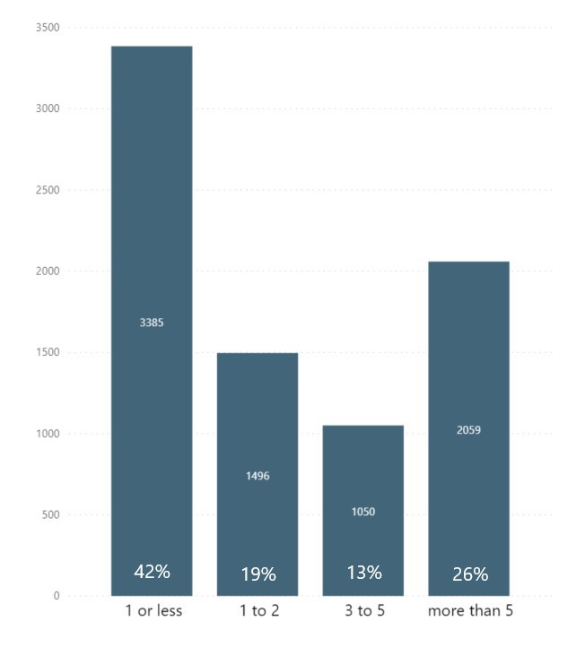
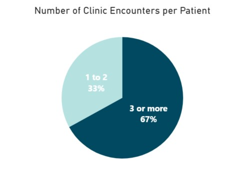

# Smile On Project

This was the second of two all-class projects for the Full Time Data Analytics Cohort 2 class at Nashville Software School. The class broke into teams and came together to create a united presentation to answer the below questions for our client, Family and Children's Service.

Smile On 60+ is a Tennessee program that offers oral healthcare to Tennessee residents that are 60 years and older, low income, and don't have dental insurance. The program provides support of oral healthcare, education, and transportation.  
### More information can be found:
- https://www.tn.gov/aging/administration/seniortrust-eldertrust.html
- https://interfaithdentalclinic.com/smile-on-60/

# Data Questions  
For this project we will be answering two questions to evaluate the Smile On program:  
1. Has the Smile On program been effective?  
2. Is the Smile On program being used by people in the area where tooth loss is greatest?  

# Smile On Data
Information about patients is gathered during different interactions (initial visit, checkups, etc.). We used de-identifed patient data for our analysis.

# Contributions
I did a lot of EDA on this rather messy data set that contained many nulls. Two of the simple charts that I created were included in the presentation. The first  how long it has been since the patients in the program had been to the dentist, indicating that an alarming 39% have not been to the dentist in over 3 years.

The second is a very simple chart showing how many patients had a Smile On clinic encounter 3 or more times to show they have a "dental home" and are returning for services.

 
